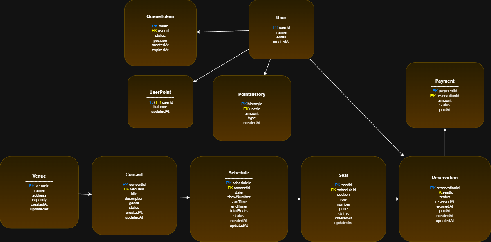

# ERD - 콘서트 예약 서비스

본 문서는 콘서트 예약 서비스의 데이터베이스 구조(ERD)를 정의합니다.  
주요 엔티티와 그 관계, 필드 정의를 포함합니다.

---

## 📌 엔티티 목록

- Venue (공연장)
- Concert (콘서트)
- Schedule (공연 스케줄: 날짜 + 회차)
- Seat (좌석)
- Reservation (예약)

---

## 📌 ERD 다이어그램 

---

## 📌 테이블 상세 정의

---

## 1. Venue (공연장)

| 필드명 | 타입 | 설명 |
|--------|--------|--------|
| venueId | BIGINT (PK) | 공연장 ID |
| name | VARCHAR | 공연장 이름 |
| address | VARCHAR | 주소 |
| capacity | INT | 수용 인원수 |
| createdAt | DATETIME | 생성 일자 |
| updatedAt | DATETIME | 수정 일자 |

---

## 2. Concert (콘서트)

| 필드명 | 타입 | 설명 |
|--------|--------|--------|
| concertId | BIGINT (PK) | 콘서트 ID |
| venueId | BIGINT (FK → Venue.venueId) | 공연장 ID |
| title | VARCHAR | 콘서트명 |
| description | TEXT | 콘서트 설명 |
| genre | VARCHAR | 장르 |
| status | ENUM(OPEN, CLOSED) | 예매 상태 |
| createdAt | DATETIME | 생성 일자 |
| updatedAt | DATETIME | 수정 일자 |

---

## 3. Schedule (스케줄: 날짜 + 회차)

| 필드명 | 타입 | 설명 |
|--------|--------|--------|
| scheduleId | BIGINT (PK) | 스케줄 ID |
| concertId | BIGINT (FK → Concert.concertId) | 콘서트 ID |
| date | DATE | 공연 날짜 |
| showNumber | INT | 회차 (1, 2, 3...) |
| startTime | TIME | 공연 시작 시간 |
| endTime | TIME | 공연 종료 시간 |
| totalSeats | INT | 전체 좌석 수 |
| status | ENUM(OPEN, SOLD_OUT, CLOSED) | 예약 가능 여부 |
| createdAt | DATETIME | 생성 일자 |
| updatedAt | DATETIME | 수정 일자 |

### 🔒 Unique 제약
UNIQUE (concertId, date, showNumber)

---

## 4. Seat (좌석)

| 필드명 | 타입 | 설명 |
|--------|--------|--------|
| seatId | BIGINT (PK) | 좌석 ID |
| scheduleId | BIGINT (FK → Schedule.scheduleId) | 스케줄 ID |
| section | VARCHAR | 구역 (A, B, C 등) |
| row | INT | 열 번호 |
| number | INT | 좌석 번호 |
| price | INT | 가격 |
| status | ENUM(AVAILABLE, TEMP_HOLD, RESERVED) | 좌석 상태 |
| createdAt | DATETIME | 생성 일자 |
| updatedAt | DATETIME | 수정 일자 |

---

## 5. Reservation (예약)

| 필드명 | 타입 | 설명 |
|--------|--------|--------|
| reservationId | BIGINT (PK) | 예약 ID |
| seatId | BIGINT (FK → Seat.seatId) | 좌석 ID |
| status | ENUM(HOLD, CONFIRMED, CANCELED) | 예약 상태 |
| reservedAt | DATETIME | 예약 시간 |
| expiredAt | DATETIME | 홀딩 만료 시간 |
| paidAt | DATETIME | 결제 완료 시간 |
| createdAt | DATETIME | 생성 일자 |
| updatedAt | DATETIME | 수정 일자 |

---

## 6. User (유저)

| 필드명 | 타입 | 설명 |
|--------|------|------|
| userId | BIGINT (PK) | 유저 ID |
| name | VARCHAR | 이름 |
| email | VARCHAR | 이메일 |
| createdAt | DATETIME | 생성 일자 |

---

## 7. UserPoint (포인트 잔액)

| 필드명 | 타입 | 설명 |
|--------|------|------|
| userId | BIGINT (PK, FK → User.userId) | 유저 ID |
| balance | BIGINT | 현재 잔액 |
| updatedAt | DATETIME | 최종 갱신 일자 |

---

## 8. PointHistory (포인트 내역)

| 필드명 | 타입 | 설명 |
|--------|------|------|
| historyId | BIGINT (PK) | 내역 ID |
| userId | BIGINT (FK → User.userId) | 유저 ID |
| amount | BIGINT | 변경 금액 (+충전, -사용) |
| type | ENUM(CHARGE, USE) | 내역 종류 |
| createdAt | DATETIME | 발생 일자 |

---

## 9. Payment (결제)

| 필드명 | 타입 | 설명 |
|--------|------|------|
| paymentId | BIGINT (PK) | 결제 ID |
| reservationId | BIGINT (FK → Reservation.reservationId) | 예약 ID |
| amount | BIGINT | 결제 금액 |
| status | ENUM(SUCCESS, FAIL) | 결제 상태 |
| paidAt | DATETIME | 결제 완료 일시 |

---

## 10. QueueToken (선택, 대기열 토큰)

| 필드명 | 타입 | 설명 |
|--------|------|------|
| token | VARCHAR (PK) | 대기열 토큰 |
| userId | BIGINT (FK → User.userId) | 유저 ID |
| status | ENUM(WAITING, ACTIVE, EXPIRED) | 상태 |
| position | INT | 대기 순번 |
| createdAt | DATETIME | 발급 시각 |
| expiredAt | DATETIME | 만료 시각 |

---

## 📌 전체 관계 요약

- Venue 1:N Concert
- Concert 1:N Schedule
- Schedule 1:N Seat
- Seat 1:1 Reservation
- User 1 ── 1 UserPoint
- User 1 ── N PointHistory 
- User 1 ── N Reservation 
- Reservation 1 ── 1 Payment 
- User 1 ── N QueueToken (선택)

본 구조는 공연장 → 콘서트 → 스케줄 → 좌석 → 예약의 흐름이며  
추가 기능(결제, 사용자 등) 확장에도 유연하게 반영 가능.

---